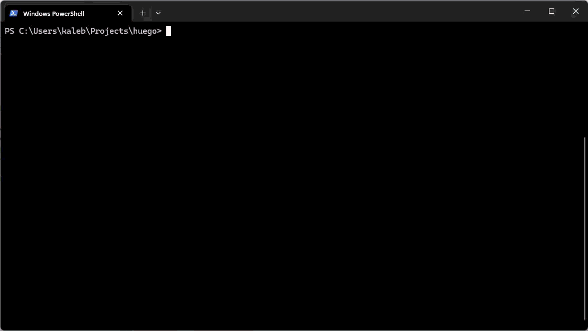

# *huego*

*huego* is a TUI application for interacting with Phillips Hue devices via the [CLIP API](https://developers.meethue.com/develop/get-started-2/).

### huego Dependencies
| Package | Purpose |
| ------- | ------- |
| [hashicorp/mdns](https://github.com/hashicorp/mdns) | used to discover Hue hubs on the local network via mDNS service discovery |
| [charmbracelet/bubbletea](https://github.com/charmbracelet/bubbletea) | provides framework for building the terminal based user interface |

### Motivation
The primary motivation behind this project was for me to learn and become familiar with the Go programming language and a bit of DevOps.

### Future Plans
- [X] Figure out best way to handle throttling of requests
- [ ] Develop tests for supporting library functionality
