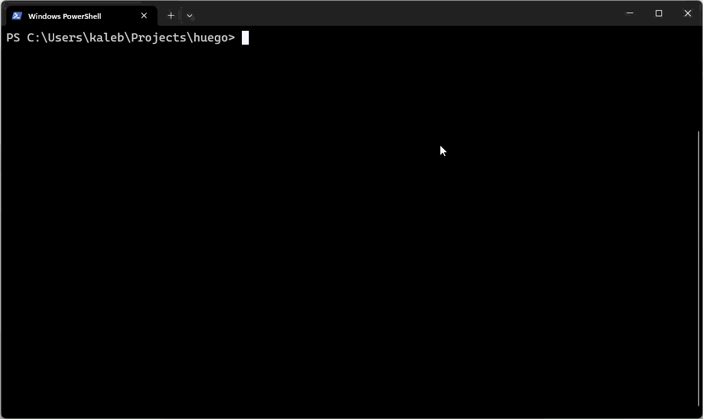

# *huego*

*huego* is a Go library for interacting with Phillips Hue devices via the [CLIP API](https://developers.meethue.com/develop/get-started-2/).

Alongside the *huego* library is a companion CLI tool called *clhue* (pronounced like 'clue') that demonstrates the functionality provided by the *huego* library. Below is a brief demo of the tool.

### clhue Dependencies
| Package | Purpose | Used by huego | Used by clhue |
| ------- | ------- | ------------- | ------------- |
| [hashicorp/mdns](https://github.com/hashicorp/mdns) | used to discover Hue hubs on the local network via mDNS service discovery | X | |
| [charmbracelet/bubbletea](https://github.com/charmbracelet/bubbletea) | provides framework for building the terminal based user interface | | X |

### Motivation
The primary motivation behind this project was for me to learn and become familiar with the Go programming language and a bit of DevOps.

### Future Plans
- [ ] Figure out best way to handle throttling of requests
  - Should this be handled by the *huego* library itself, or by the user of the library, e.g., *clhue*?
- [ ] Develop tests for *huego* functionality
- [ ] Develop documentation for *huego* library
- [ ] Add packaging for multiple OS installations
  - [ ] Windows (thinking something like an MSI)
  - [ ] Linux (.deb and .rpm)
- [ ] Take advantage of GitHub CI/CD for build process